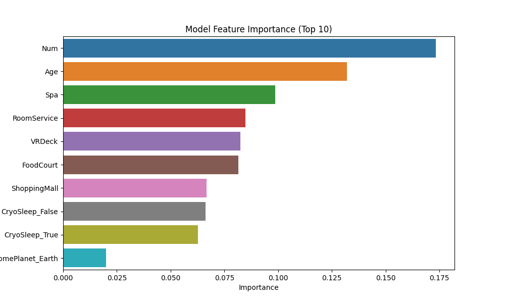

# 🚀 Competition: Spaceship Titanic

> **Predict which passengers were transported by the anomaly.** > [Kaggle Competition Link](https://www.kaggle.com/competitions/spaceship-titanic/overview)

---

## 📌 1. Project Overview

- **Objective**: 우주선 사고에서 다른 차원으로 이동(Transported)된 승객을 예측하는 이진 분류 문제.
- **Data Status**: 승객 인적 사항, 객실 정보(`Cabin`), 서비스 이용 내역(`Spa`, `VRDeck` 등) 포함.
- **Main Challenge**: `Cabin` 정보 파싱 및 다양한 결측치 처리.

## ⚙️ 2. Pipeline Architecture

이 프로젝트는 `KYUN-Pipe` 코어 모듈을 활용하여 객체지향적으로 설계되었습니다.

1.  **Data Loading**: `DataLoader`를 통한 Train/Test 세트 통합 관리.
2.  **Preprocessing**: `UniversalPreprocessor` 기반 파이프라인.
    - `CabinSplitter`: `Deck/Num/Side` 구조 분리.
    - `MissingValueFiller`: 수치형(KNN Imputer), 범주형(Most Frequent) 전략 사용.
    - `ValueEncoder`: One-Hot Encoding을 통한 수치화.
3.  **Training**: `ModelTrainer`를 이용한 Scikit-learn 모델 래핑.
4.  **Evaluation**: `ModelEvaluator`를 통한 Accuracy/F1 및 Feature Importance 분석.
5.  **Reporting**: `ResultReporter`를 통한 실험 결과(Metrics, Model, Metadata) 자동 아카이빙.

## 🚀 3. How to Run

본 프로젝트는 `uv` 패키지 매니저를 사용합니다.

```bash
# 의존성 설치
uv sync

# 메인 실험 실행
python main.py
```

## 💡 Key Insights

- **Feature Engineering**: `Cabin` 데이터를 `Deck`, `Num`, `Side`로 분리하는 과정이 모델 성능의 베이스라인을 결정짓는 핵심 요소임을 확인했습니다. 특히 `Deck` 위치에 따른 승객의 생존율(Transported) 차이가 유의미하게 나타납니다.
  
- **Advanced Imputation**: 단순 평균/최빈값 처리가 아닌 `KNN Imputer`를 도입하여, 승객의 소비 패턴(Spa, VRDeck, RoomService 등) 간의 상관관계를 반영한 정교한 결측치 처리를 수행했습니다.
  
- **Data Integrity**: `UniversalPreprocessor`를 통해 훈련 데이터(Train)에서 학습한 통계치를 테스트 데이터(Test)에 유출 없이 적용하는 구조를 구축하여 **Data Leakage**를 원천 차단했습니다.
- **Interpretability**: `ModelEvaluator`의 특성 중요도(Feature Importance) 분석을 통해 `CryoSleep` 여부와 `Spa/VRDeck` 지출 비용이 예측의 핵심 변수임을 파악했습니다.
  

## 📊 Results & Artifacts

실험 결과물은 `ResultReporter`에 의해 타임스탬프 기반 폴더에 자동 아카이빙됩니다.

| Artifact          | Description                                             | Format |
| :---------------- | :------------------------------------------------------ | :----- |
| `metadata.json`   | 사용된 피처 리스트, 모델 하이퍼파라미터, 실행 환경 정보 | JSON   |
| `metrics.json`    | Accuracy, F1-Score, Precision, Recall 등 검증 지표      | JSON   |
| `predictions.csv` | Kaggle 제출을 위한 최종 테스트 세트 예측 결과           | CSV    |
| `model.pkl`       | 재사용 및 배포가 가능한 학습된 모델 객체                | Joblib |
