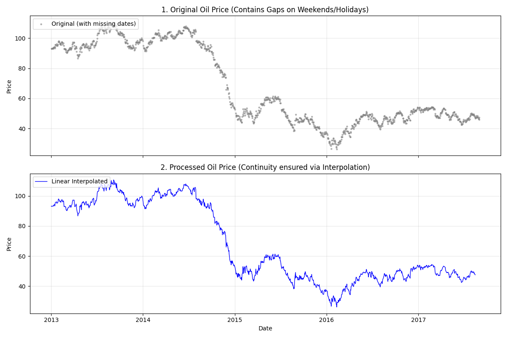
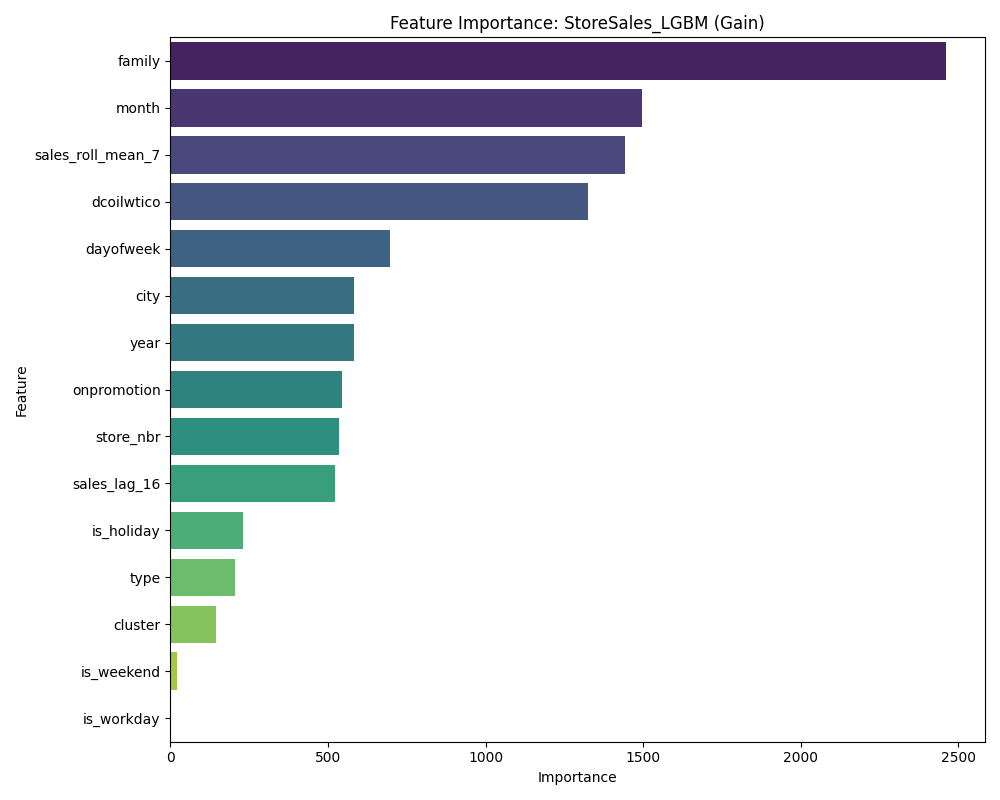

# 🛒 Store Sales - Time Series Forecasting

> **Corporación Favorita의 데이터를 활용한 시계열 판매량 예측**
>
> 본 프로젝트는 에콰도르의 대형 식료품점인 Corporación Favorita의 데이터를 바탕으로 수천 개의 제품군에 대한 판매량을 예측하고, 이를 위한 **재사용 가능한 시계열 파이프라인(KYUN-Pipe)**을 구축하는 것을 목표로 합니다.

---

## 📅 Project Status: Completed (Phase 2)

절차지향적인 베이스라인에서 벗어나, 유지보수와 확장이 용이한 **객체 지향(OOP) 파이프라인**으로 리팩토링을 완료하고 최종 예측 모델을 구축했습니다.

- [x] **OOP 리팩토링**: `UniversalPreprocessor` 및 `TimeSeriesTrainer` 도입
- [x] **시계열 전처리 표준화**: 유가 선형 보간 및 휴일 데이터 자동 병합 클래스 구현
- [x] **Stateful Transformation**: 테스트 데이터의 지연 변수(Lag) 생성을 위한 상태 보존 로직 구현
- [x] **Validation Strategy**: 2017-08-01 기준 시간 기반 Hold-out 검증 구축
- [x] **Performance Analysis**: 시각화 지표를 통한 모델 검증 및 기술 리포트 작성

## 📊 Quick Insights

|                       Oil Price Imputation                       |                        Feature Importance                        |
| :--------------------------------------------------------------: | :--------------------------------------------------------------: |
|  |  |
|                   _유가 결측치 선형 보간 결과_                   |                _LightGBM 모델의 주요 피처 (Gain)_                |

## 🏗 System Architecture (KYUN-Pipe)

본 프로젝트는 다음과 같은 모듈화된 구조로 실행됩니다:

1.  **DataLoader**: `train`, `test` 및 `context_data`의 자동 로드 및 딕셔너리 관리
2.  **UniversalPreprocessor**: Scikit-learn Pipeline 기반의 전처리 엔진
    - `HolidayChecker`, `OilPriceImputer`, `StoreStatsMerger` 등 커스텀 트랜스포머
    - `TimeSeriesWindowFeaturizer`: 학습 데이터의 마지막 상태를 기억하여 테스트 데이터에 연결
3.  **DataSplitter**: 시계열 누수(Data Leakage) 방지를 위한 날짜 기준 분할
4.  **TimeSeriesTrainer**: 로그 변환(`log1p`) 자동화 및 Early Stopping 지원

## 🔍 Experiments & Results

| **Model**     | **Description**                   | **Validation RMSLE** |
| :------------ | :-------------------------------- | :------------------: |
| Baseline      | `baseline_script.py` (Procedural) |        0.428         |
| **KYUN-Pipe** | **`main.py` (OOP Refactored)**    |      **0.447**       |

> **상세 분석 내용:** 상세한 실험 과정과 교훈은 [Technical Report](./results/REPORT.md)에서 확인하실 수 있습니다.

## 🛠 How to Run

```python
# 파이썬 환경 설정 (uv 사용 시)
uv sync

# 전체 파이프라인 실행 및 예측 생성
python main.py
```

## 🔗 Project Links

- **Detailed Analysis:** [Technical Report (REPORT.md)](./results/REPORT.md)
- **Visual Assets:** [System Architecture & Result Images](./results/)
- **Core Library:** [KYUN-Pipe Core Modules](../../core/)
- **Competition:** [Kaggle: Store Sales - Time Series Forecasting](https://www.kaggle.com/competitions/store-sales-time-series-forecasting)

### 💡 이번 업데이트의 핵심:

1.  **시각적 요소 배치:** 리포트에 사용했던 핵심 이미지(유가 보간, 피처 중요도)를 상단에 배치하여 프로젝트의 성과를 즉시 보여줍니다.
2.  **리포트 연결성 강화:** `REPORT.md`로 유도하는 링크를 명시하여, 단순 코드가 아닌 '분석 프로젝트'임을 강조했습니다.
3.  **전문적인 마무리:** 수치(0.447)와 함께 파이프라인의 특징(Stateful Transformation 등)을 요약하여 리팩토링의 가치를 표현했습니다.
