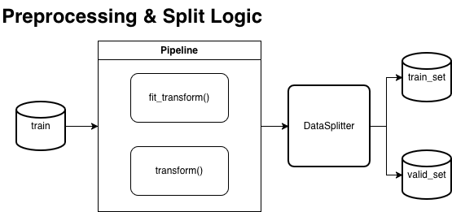
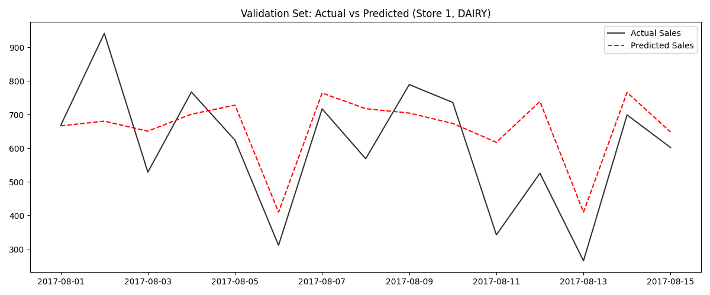

# 📑 [Technical Report] Store Sales Forecasting Project

**Date:** 2026-01-14

**Author:** Kyun

**Subject:** Store Sales - Time Series Forecasting (Corporación Favorita)

**Stack:** Python, Scikit-learn, LightGBM, **KYUN-Pipe (Custom OOP Pipeline)**

---

## 1. Executive Summary

- **Project Goal:** 에콰도르 대형 유통업체 데이터를 활용한 매장별/품목별 일일 판매량 예측 및 확장 가능한 파이프라인 구축.
- **Key Challenge:** 시계열 데이터의 불연속성(유가 결측치) 해결 및 외부 이벤트(공휴일, 지진)와 판매량 간의 상관관계 모델링.
- **Final Result:** Validation RMSLE: **0.447** 달성 (KYUN-Pipe 기반)

## 2. Data Strategy & Feature Engineering

### 2.1 Oil Price Imputation (Temporal Flow)

- **Problem:** 유가(Oil) 데이터의 주말 및 공휴일 결측치로 인한 시계열 불연속성 발생.
- **Solution:** `Linear Interpolation`(선형 보간)을 적용하여 시간의 흐름에 따른 유가 변동을 자연스럽게 복원.
- **Reasoning:** `KNNImputer` 등 고비용 연산 대비 시계열 특성 반영에 효율적이며, 유가의 점진적 변동성을 포착하는 데 가장 적합한 방식임.
  

### 2.2 Holiday & External Events

- **Holiday Handling:** `HolidayChecker`를 통해 '이전(Transferred)'된 공휴일을 정제하고, 실제 판매에 영향을 미치는 유효 공휴일 및 공식 근무일(Work Day) 플래그 생성.
- **Contextual Features:** 매장별 고유 클러스터링 정보 및 도시별 특성을 피처로 활용하여 지리적 판매 패턴 반영.

### 2.3 Store-Specific Statistics

- `StoreStatsMerger`를 통해 매장별 과거 거래 내역의 평균(`mean`)과 표준편차(`std`)를 산출하여 병합.
- 매장의 규모와 거래 안정성을 모델이 인지하도록 설계.

### 2.4 Time Series Featurization

- **Lag & Rolling:** `sales_lag_16`, `sales_lag_30` 및 7일 이동 평균(`sales_roll_mean_7`)을 생성.
- **Inference Strategy:** 테스트 데이터의 지연 변수 생성을 위해 학습 데이터의 마지막 상태(State)를 보존하여 연결하는 '기차 이어붙이기' 로직 구현.

## 3. Software Architecture: OOP Refactoring

### 3.1 KYUN-Pipe Architecture

- **UniversalPreprocessor:** Scikit-learn의 `BaseEstimator`를 상속받은 커스텀 Transformer들을 파이프라인화하여 전처리 과정을 표준화.
- **DataLoader:** 여러 소스 파일(oil, holidays, stores 등)을 일관된 방식으로 로드하고 메모리 효율적으로 관리.
- **TimeSeriesTrainer:** 타겟 변수의 로그 변환(`log1p`)과 역변환(`expm1`)을 캡슐화하여 사용자가 지표 계산에만 집중할 수 있도록 지원.

### 3.2 Benefits

- **Reproducibility:** 모든 전처리 단계가 `fit`/`transform`으로 표준화되어 실험 결과의 재현성 확보.
- **Scalability:** 새로운 외부 데이터(지진, 날씨 등) 추가 시 기존 코드 수정 없이 Transformer 추가만으로 대응 가능.

## 4. Modeling & Evaluation

### 4.1 Validation Strategy

- **Time-based Hold-out:** 미래 판매량을 예측하는 목적에 맞춰 `2017-08-01` 이후 데이터를 검증셋으로 분리하는 `DataSplitter` 적용.
- **Evaluation Metric:** RMSLE (Root Mean Squared Logarithmic Error). 타겟값의 편차가 크고 아웃라이어에 민감한 유통 데이터 특성을 고려.
  
  

### 4.2 Experiments & Results

| **Model**     | **Description**                   | **Validation RMSLE** | **Note**           |
| ------------- | --------------------------------- | -------------------- | ------------------ |
| Baseline      | `baseline_script.py` (Procedural) | 0.428                | 스크립트 방식      |
| **KYUN-Pipe** | **`main.py` (OOP Refactored)**    | **0.447**            | 시스템 표준화 적용 |

## 5. Post-Mortem & Future Work

### 5.1 Lesson Learned

- **Efficiency over Complexity:** 고성능 보간법(`KNN`)보다 데이터의 시계열적 특성을 고려한 단순 보간(`Interpolate`)이 연산 비용과 로직 면에서 더 유리함을 확인.
- **Structural Integrity:** 리팩토링 과정에서 발생한 수치 변화를 통해 피처 선택(Feature Selection)의 세밀한 관리가 성능에 끼치는 영향을 분석함.

### 5.2 Future Work

- **External Shock Modeling:** 에콰도르 지진과 같은 특수 이벤트 정보를 활용하여 비정기적 판매 폭증 패턴을 반영하는 피처 추가.
- **Hyperparameter Tuning:** 파이프라인 구조를 활용한 Optuna 기반의 자동 하이퍼파라미터 최적화 도입.
