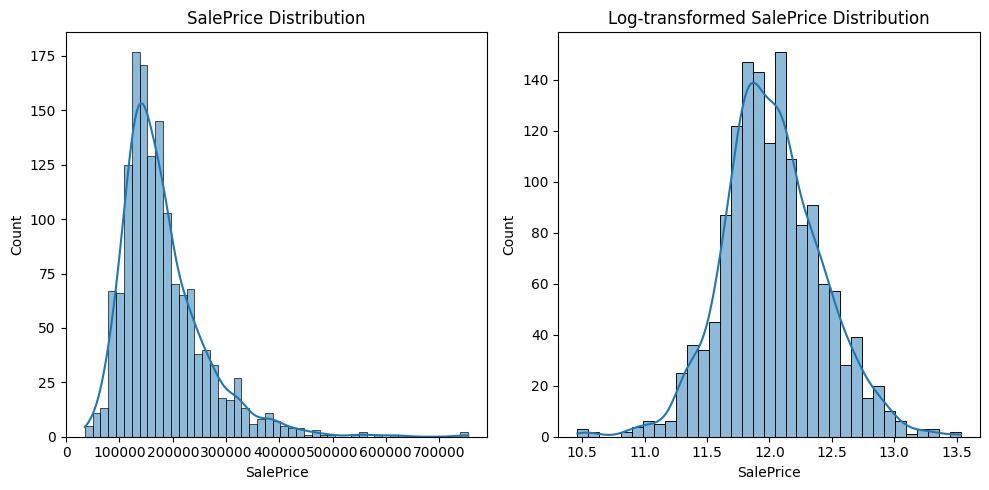
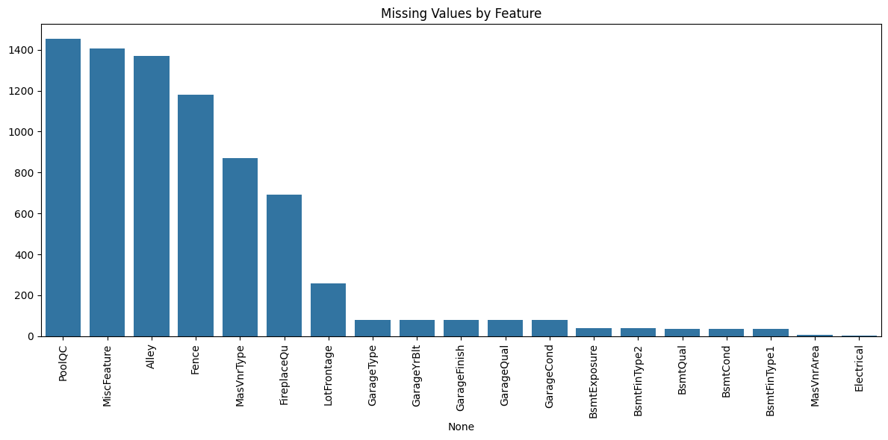
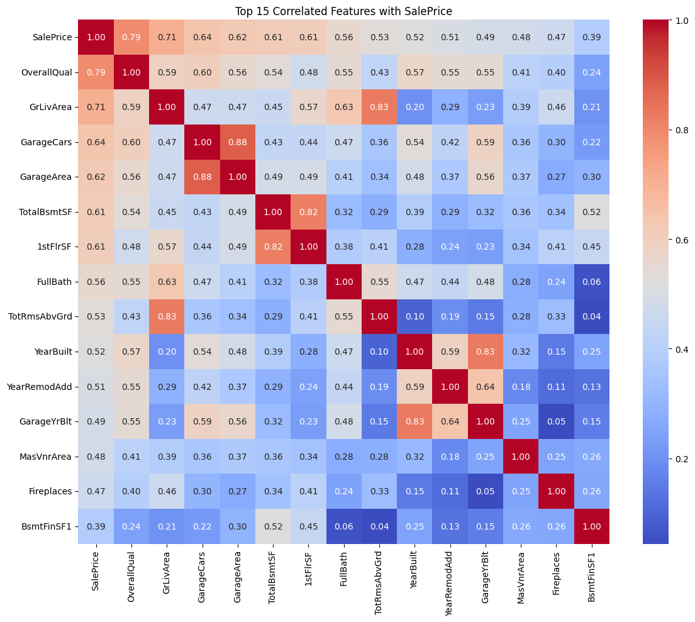
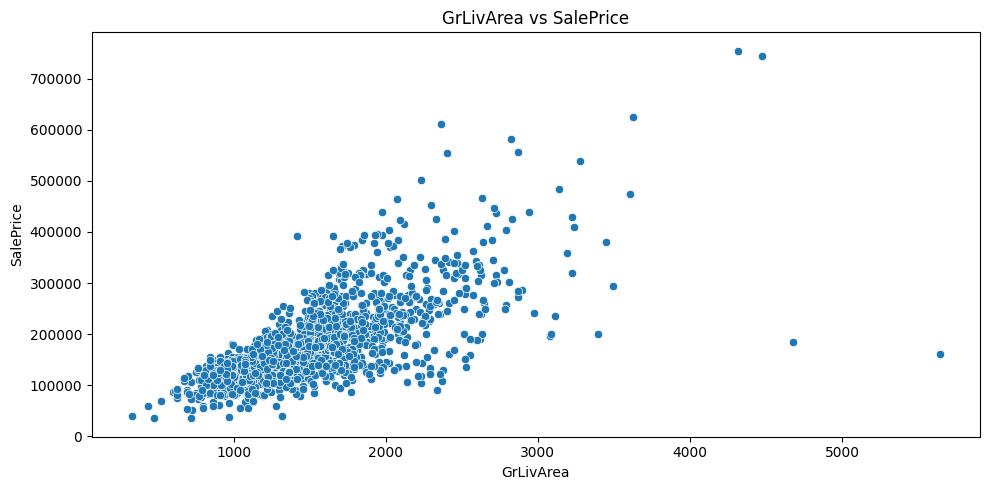
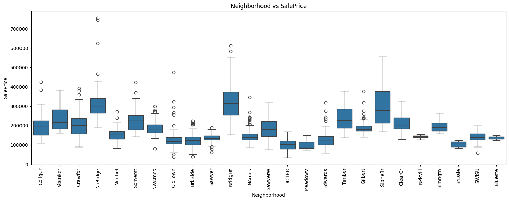

# 🧪 EDA Notes — House Prices (Intermediate)

> 이 문서는 **중간 EDA 과정과 관찰(Observation) / 가설(Hypothesis) / 다음 액션(Action)** 을 기록하기 위한 노트입니다.
>
> - **README.md**: 프로젝트 개요/실행 방법/구조
> - **REPORT.md**: 최종 성능, 실험 결론, 제출 결과
> - **EDA.md(본 문서)**: EDA 중간 결과 및 의사결정 근거

---

## 0) Scope & Goal

- **Goal**: `SalePrice` 예측을 위한 데이터 이해(분포/결측/상관/이상치) 및 전처리 방향 수립
- **Deliverables**
  - 분포/결측/상관/이상치에 대한 핵심 시각화
  - 전처리 전략 초안(결측치, 인코딩, 스케일링, 타겟 변환)
  - 다음 실험(Feature Engineering/Modeling)로 이어지는 체크리스트

---

## 1) Dataset Quick Info

- Competition: _House Prices - Advanced Regression Techniques_
- Primary files
  - `train.csv` (label 포함)
  - `test.csv` (label 없음)
- Target: `SalePrice`

---

## 2) Target Variable (`SalePrice`) — Distribution

### Observation

- `SalePrice`는 일반적으로 **우측 꼬리(positive skew)** 가 강함.
- 로그 변환(`log1p`) 이후 분포가 더 정규에 가까워지는 경향.

### Decision

- 모델 학습 타겟은 `y = log1p(SalePrice)`를 기본 옵션으로 고려
  (최종 평가/해석 시에는 `expm1`로 원복)

### Artifacts

- 

---

## 3) Missing Value Analysis

### Observation

- 결측치는 “랜덤”이라기보다 **도메인 의미가 있는 결측**이 다수(예: 특정 시설이 없어서 NA).
- 일부 컬럼은 결측이 매우 많아, 단순 삭제는 정보 손실이 클 수 있음.

### Hypothesis

- 범주형 결측은 `"No"` 같은 명시적 레이블로 채우는 것이 의미적으로 맞는 경우가 많음.
- 수치형 결측은 KNN/Median 등 대안 비교 필요. (KNN은 상관 구조를 활용하지만 과적합/누수 위험도 점검)

### Artifacts

- 

---

## 4) Correlation (Numeric) — Strong Signals

### Observation

- `SalePrice`와 강한 상관을 가지는 수치형 피처들이 존재(예: 품질/면적 계열).
- 다중공선성 가능성도 함께 존재(면적 관련 피처끼리 상관이 강함).

### Decision (Draft)

- 초기 모델은 “상관 상위 피처” 기반으로 빠르게 베이스라인을 만들되,
- 이후 단계에서:
  - 규제(릿지/라쏘) 기반 선택,
  - 트리 모델 중요도,
  - permutation importance,
  - SHAP
    등을 통해 안정적인 피처 셋으로 정제.

### Artifacts

- 

---

## 5) Outliers — High Leverage Points

### Observation

- 면적(예: `GrLivArea`) 대비 가격이 비정상적으로 낮거나,
- 가격이 매우 높아서 손실에 큰 영향을 주는 포인트가 존재할 수 있음.

### Decision (Draft)

- 무조건 제거하지 않고, 아래 순서로 접근:
  1. “이상치 후보”를 정의(규칙 기반)
  2. 제거 전/후 성능 비교
  3. 제거가 과도한 편향을 만들지 확인

### Artifacts

- 

---

## 6) Categorical Variables — Price Segmentation Clues

### Observation

- `OverallQual`(수치형이지만 사실상 서열형) 같은 변수는 가격을 강하게 구분.
- `Neighborhood` 같은 범주형은 **가격 레벨을 구간별로 나누는 힘**이 큼.

### Encoding Strategy (Draft)

- **서열(Ordinal) 의미가 확실한 컬럼**: ordinal encoding 고려
- **일반 범주형**: one-hot encoding 기본
- (추후) target encoding / CatBoost encoding 같은 기법은 누수 관리 포함해서 별도 실험

### Artifacts

- 
- 

---

## 7) Preprocessing Plan (Working Draft)

> 아래는 “현재까지 EDA 기반으로 합리적”인 초안이며, 모델별로 조정 예정.

### 7.1 Missing Values

- Categorical: 의미 있는 결측은 `"No"` 등으로 명시화(`pandas`에서 read 시에 모두 NaN으로 처리됨.)
- Numeric: Median vs KNN 비교 (KNN은 반드시 CV로 검증)

### 7.2 Encoding

- Ordinal-like columns: ordinal/label encoding 후보
- Others: one-hot encoding

### 7.3 Scaling

- 선형/거리 기반 모델(Linear, SVR, KNN 등): scaling 필요
- 트리 기반 모델(RF/GBDT/LGBM): scaling 영향 적음
  → 파이프라인에서 “모델 타입에 따라 스케일링 On/Off” 옵션화 권장

### 7.4 Target Transform

- 기본: `log1p(SalePrice)`
- 평가/리포트: 원복(`expm1`) 기준 RMSE/RMSLE를 함께 확인

---

## 8) Next Actions (Checklist)

- [x] 이미지 파일명 리네이밍(의미 기반) + 문서 링크 업데이트
- [x] 결측치 처리 전략 2~3개 비교 (Median / KNN / Domain fill)
- [x] Encoding 전략 비교 (OneHot only vs 일부 Ordinal + OneHot)
- [ ] Outlier 처리 유무 성능 비교 (rule-based 후보군)
- [ ] 모델 후보군 구성
  - [ ] Baseline: Ridge/Lasso, RandomForest
  - [ ] Main: LightGBM / XGBoost(가능 시)
- [ ] CV 전략 확정 (KFold / Repeated KFold 등, 누수 점검 포함)

---

## Appendix) Notes

- 본 문서의 관찰/결론은 **중간 기록**이며, 최종 판단은 `REPORT.md`에 반영합니다.
